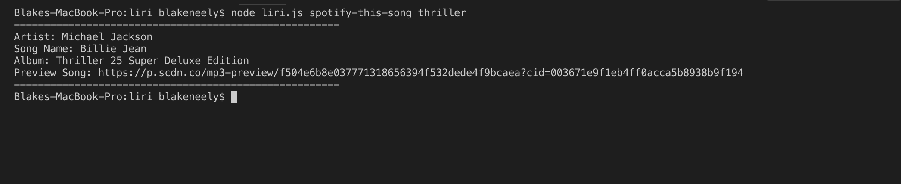
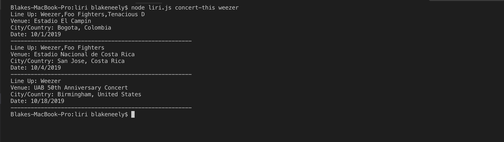
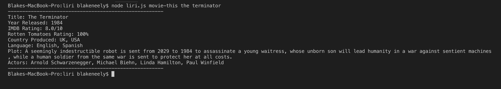
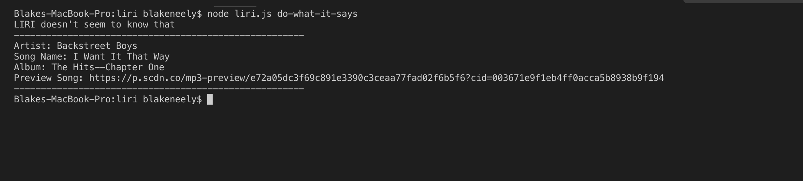

# Liri

## Description
This JavaScript app is built with Node and runs completely in the Terminal with given commands. Have you ever wanted to know some quick info about a song? Or maybe you'd like to know some info about when a band/artist is playing their next show? Well how about have you ever wanted to know some info about a movie you love? Well this app does all 3. Simply follow these commands:

### Video Demo
<a href="https://drive.google.com/open?id=1Pf44eiQP0nLAjWw06ZE3getZVHCp8eHX">Click here</a> for a video demo

### List of Commands
To learn about a song simply type "spotify-this-song" followed by your song title. Here's an example:

    node liri.js spotify-this-song <your song title here>

To see when an artist/band's next live show is, type "concert-this" followed by the artist/band. Like this:

    node liri.js concert-this <your artist/band>

To see some information about a movie, type "movie-this" followed by the movie title:

    node liri.js movie-this <your movie title>

Finally there is one last command: "do-what-it-says"

Running this command reads whatever is in the random.txt file and executes:

    node liri.js do-what-it-says

### Screenshots of Liri running

